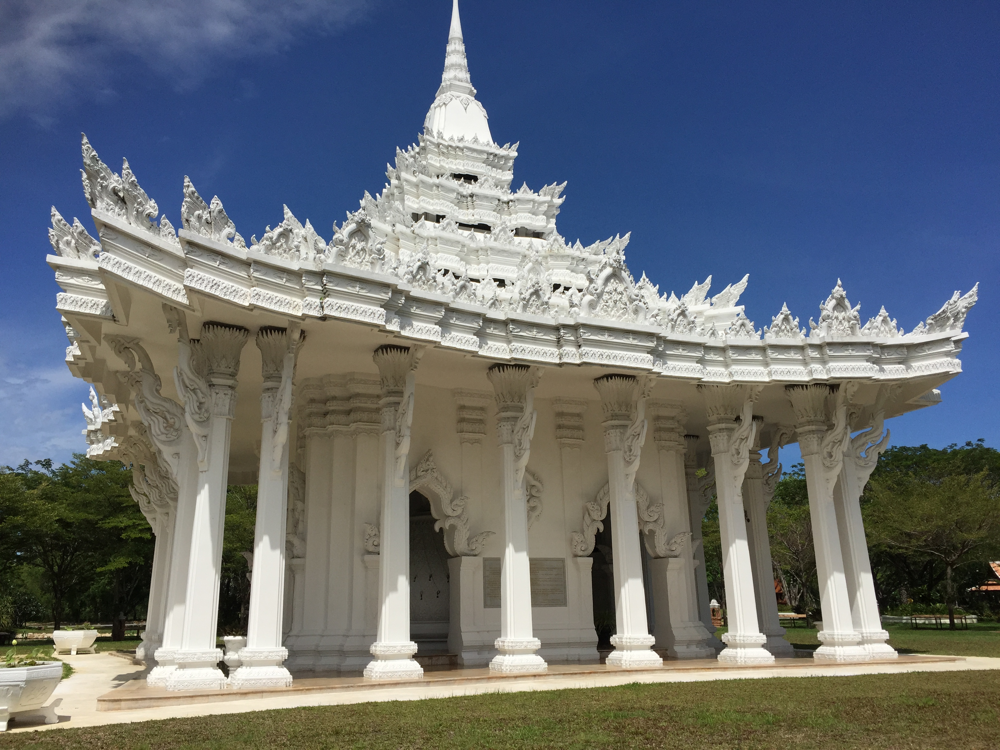
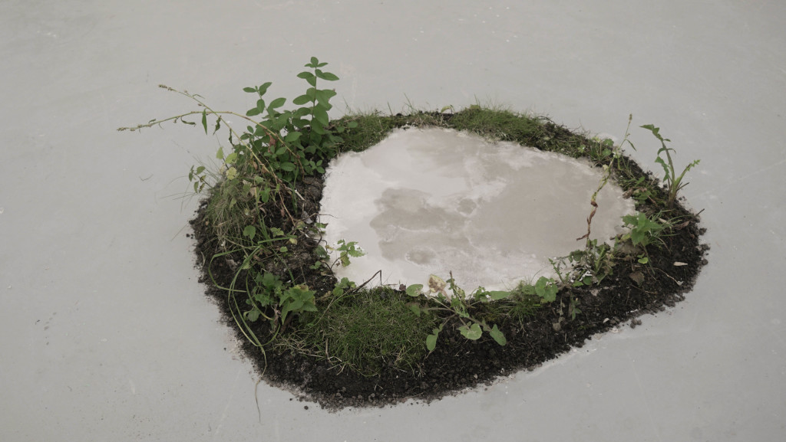

This is an essay I wrote in Fall 2021 for my [Southeast Asian R5A: Self, Representation, and Nation](https://guide.berkeley.edu/courses/seasian/) class. I want to thank the instructor, Katherine Bruhn (PhD candidate) for her help and feedback.

## My positionality
I hadn't thought about Southeast Asia for a long time when I enrolled this class. I’ve visited Southeast Asia—Malaysia, Singapore, and Thailand—three times, but it’s been around ten years since my last trip there. This picture is from my 2013 trip to Bangkok, Thailand. 👇

Contemporary art isn’t usually my thing, but I wanted to give this class a shot since its description seemed interesting. I'm glad I took it because it's made me see both Southeast Asia and art in a new light.

---

## Introduction: The Inevitability of Human Extinction and the Role of Anthropocentrism

What do the woolly mammoth and the dodo bird have in common? Both species roamed the earth until one day, they both went extinct. In fact, due to human impact and natural reasons, several species go extinct every day, which hints at the terrifying inevitability of Homo sapiens going extinct. Why do we regard human extinction as any different from the extinction of, say, the Tasmanian tiger? It is natural for our thinking to be anthropocentric because one is only capable of experiencing reality from an individual’s point of view—a human being’s point of view. Imagining another human being’s reality can already be challenging, let alone attempting to imagine a future without humans. Although the collapse of *Homo sapiens* is difficult to grasp, companies and factories across the world are constantly contributing to the collapse of the human race. The Grasberg mine, for example, has led to environmental degradation in West Papua, Indonesia that has negatively impacted local villagers’ physical and financial well-being. Another example is limestone mining in Northern Vietnam’s mountains, which has destroyed local ecosystems and landscapes, and is the central topic of artist Tuan Mami’s installation *[In One’s Breath - Nothing Stands Still](https://www.youtube.com/watch?v=PycweqXXFoA)* (see image below for a snapshot of part of the exhibition). 
 

In his work, Mami offers a vivid first-hand account of the environmental damage created by extractivism and industrialization. Mami’s artwork is open to interpretation, but reading a theoretical text like Dipesh Chakrabarty’s “Climate of History,” which discusses the limitations of restricting the conversation around climate change to capitalism, provides viewers with a new outlook on the exhibit by encouraging viewers to see Mami’s art as a comment on greed instead. Chakrabarty also brings attention to Homo sapiens’ common fate in the face of global warming, allowing readers to interpret Mami’s exhibition as a piece of art that showcases the importance of long-term, collective thinking. Thus, *In One’s Breath - Nothing Stands Still* should be interpreted as a critique of greed and a reminder of the importance of species thinking; in the process of realizing humans as a collective to better approach the climate crisis, however, one must refrain from homogenizing all populations’ experiences, since, as examples of extractivism in Vietnam and West Papua show, said experience is not equal for all groups.

## Environmental Degradation in Art: Tuan Mami’s Critique of Extractivism

Serene, seemingly still mountains and ambient noise surround the viewer when they first enter the *In One’s Breath - Nothing Stands Still* exhibit. The mountains appear to be calm and undisturbed in videos projected onto walls around the viewer, but what seems like fog or mist near the mountains is, in fact, a “dirty white veil of...dust ” produced by limestone mining in the area (Lovatt 224). The stationary white dust clouds not only highlight the physical damage extractivism has done to local ecosystems and those who inhale the toxic air near limestone mines, but the dust clouds’ eerie stillness also hints at a dystopian future in which humans no longer exist, while human impact on nature persists. The video installation’s sound design, which mostly consists of silence and abstract sounds, reinforces the image of a nature devoid of human life. Typically, music or vocals accompany videos to further engage the audience, but the only sounds present in this installation resemble white noise and are sampled from recordings of industrial machinery and environmental noise at mining sites to continue the theme of the absence of human elements in the exhibit. We experience reality as humans, so it is understandably difficult for us to escape human-centric ways of thinking and envision a human-less future. With the help of Mami’s non-anthropocentric, detached presentation of air pollution in Hà Nam’s mountains, though, we can more easily visualize the long-term consequences of anthropogenic climate change on Homo sapiens as a species.

## Shared Human Experience: Mami’s Art as a Reflection of *Homo Sapiens’* Common Fate

Mami’s exhibition calls attention to the relevance of a shared human experience by materializing a bleak reality devoid of humans; therefore, viewers should interpret *In One’s Breath - Nothing Stands Still* as a representation of Homo sapiens’ common fate in the face of climate change and as a reminder of our collective responsibility to respond to the climate crisis. The exhibition creates a sense of urgency by reminding viewers of the gravity of the issue at hand, as climate change affects all humans—rich or poor, capitalist or socialist. Author Dipesh Chakrabarty further accentuates the importance of “species history” in his essay by explaining that only when humans can relate to a universal experience will we be able to understand and approach the challenge climate change poses for us as a collective (Chakrabarty 220). Reading Chakrabarty’s text adds a layer of meaning to Mami’s installation, as the article shifts the exhibit’s focus from the evils of capitalism to the very real possibility of human extinction—the most serious, universal consequence of our current flawed approach to climate change.

## Understanding Climate Change Beyond Capitalism

One could interpret Mami’s work as a critique of the mining industry, its corporations, and thus of capitalism, but Chakrabarty’s text offers insight into why seeing the exhibit as a critique of capitalism alone is not sufficient for us to understand the implications of today’s climate crisis. There is no doubt that the Industrial Revolution and subsequent technological progress gave humans the power to influence Earth’s geological processes. It is not capitalism alone, however, that has pushed corporations and countries to take advantage of Earth’s natural resources. Take petroleum for example: as Chakrabarty indicates in his essay, there has never been a “principled difference in [capitalist and socialist societies’] use of fossil fuels” (Chakrabarty 217). In other words, a country’s socioeconomic system is not the distinguishing factor that determines whether its government chooses to disrupt ecosystems through fossil fuel extraction or to abuse its natural resources in some other manner. Excessive limestone mining leading to environmental degradation in Vietnam, which happens to be the subject of Mami’s artwork, is an instance of a non-capitalist country overexploiting its natural resources. Vietnam is one... 

## Greed as a Driving Force Behind Environmental Exploitation

Perhaps a more effective approach to understanding what drives anthropogenic activities is to look past the socioeconomic systems created by humans and to examine what drives humans themselves; from this perspective, we see that greed, a fundamental human trait, is the underlying common factor among those in power. A desire for wealth is what motivates those in power to take advantage of their countries’ natural resources or of other resource-rich, typically poorer nations’ resources since valuable raw materials translate to economic prosperity and political influence. Those who control the extractive industry are quintessential examples of people in power benefitting from natural resources but damaging environmental and human health in the process. What Mami depicts in his exhibit is relevant once again, as Limestone mining in Hà Nam is a specific instance of extractivism. Vietnam’s mining industry has grown over time since limestone is necessary for the production of cement, a material “in high demand” due to the expansion of the country’s construction sector (Lovatt 223). It is also worth noting that Vietnam’s construction industry is an essential pillar of its economy. Unfortunately, the price of supporting the extractive sector’s development to satisfy the government’s desire for GDP growth is biodiversity loss, environmental destruction, and land dispossession, all of which adversely affect the local indigenous Mường community.

## Extractivism and Its Disproportionate Impact on Indigenous Communities

Another extractivism-related example of greed-driven natural resource abuse is the Grasberg mine and its environmental and health impacts on West Papua as well as local indigenous communities. When a Dutch geologist discovered gold in West Papua’s Mount Carstensz, American mining company Freeport McMoRan jumped at the opportunity to capitalize on the area’s abundance of minerals. Today, the area is known as the Grasberg mine, worth approximately “$100 billion” and one of the “biggest gold...and copper [mines]” in the world (Schulman). The billions of dollars brought in by the Grasberg mine benefitted those who controlled Freeport McMoRan, including business magnate Rockefeller and former U.S. Secretary of State Henry Kissinger. The income from the mine played a role in helping those like Kissinger and Rockefeller gain wealth and social status, and the mine continues to benefit those who currently control Freeport McMoRan. However, West Papua’s indigenous population has had to undergo considerable amounts of distress while receiving virtually none of the benefits generated by the Grasberg mine. In fact, Papua has the “highest poverty rate” and the “worst health indicators” in Indonesia (Schulman). Since many Papuans’ livelihoods depend on the very environment that has been devastated by deforestation, pollution, and flooding due to mining activity, most locals struggle to earn money in addition to having to suffer the health impacts of industrial mining. Freeport McMoRan’s greed-driven shareholders aim to maximize their profits, so they have little to no incentive to compensate Papuans for the damage the mining company has done to the environment and to locals’ health.

## Economic Inequality in the Face of Climate Change: A Critique of the Common Fate Argument

Both aforementioned examples of extractivism, one in Vietnam and one in West Papua,  highlight a flaw in Chakrabarty’s common fate argument by bringing attention to the disproportionate environmental health risks many indigenous communities face despite having exploited nature the least. Indeed, *Homo sapiens* may one day go extinct as a whole, just like any other animal species on Earth has the potential to face extinction, but racial and economic inequalities within the human population make “people of color and the poor” more susceptible to environmental health hazards in the gradual process of extinction (Cuomo 695). Among POC groups, indigenous communities are particularly vulnerable to environmental threats compared to other disadvantaged populations because their livelihoods are often entirely dependent on nature. Villagers who live close to the Grasberg mine, for instance, were able to make a living as fishermen and foragers until the water was contaminated by tailings, fish were suffocated by sedimentation, and green spaces were rendered barren by pollution and deforestation. The Mường people in Hà Nam have a tight-knit relationship with nature as well, yet increasing industrialization and development in the mountains where they live have forced them to give up parts of their largely nature-reliant way of life.

## Conclusion

While mining activity in West Papua and Vietnam has led to environmental contamination and degradation, severely affecting indigenous communities in both areas, the mines’ wealthy owners remain unaffected by the mines’ toxic byproducts. For instance, American mining company Freeport McMoRan takes advantage of Indonesia’s gold and copper but the company’s shareholders and the United States’ environment have been free from the environmental and health risks created by the mine so far. In fact, the United States’ economic stability was built on centuries of “unchecked development and energy consumption,” while developing nations like Indonesia have produced less pollution but have to suffer most of the negative consequences of wealthy nations’ decades of industrial activity (Cuomo 693). This highlights a shortcoming in Chakrabarty’s common-fate argument once again, as we see unequal treatment based on economic status in the face of climate change: the economic gap between developed and developing nations continues to widen, with wealthy nations reaping the benefits of anthropogenic activities and poor nations suffering from said activites’ environmental consequences and health threats. The climate crisis is, ultimately, a product of industrialization with a long history of colonialism and exploitation, as the aftermath of the Grasberg mine demonstrates, so we should avoid homogenizing all humans’ experiences in the face of global warming’s effects, as that experience varies depending on factors such as race and economic status. While we should acknowledge inequalities regarding different populations’ varying levels of susceptibility to environmental threats, Chakrabarty helps us realize the significance of humans adopting a long-term, collective approach to tackling climate change. That is, a text like “The Climate of History” shows that we should understand the implications of climate change by taking into account the history of Homo sapiens. Together with Chakrabarty’s essay, Mami’s videos of Northern Vietnam’s bleak, lifeless mountains capture the consequences of greed-driven environmental degradation and serve as reminders of the very real and somewhat terrifying prospect of human extinction. After understanding the gravity of the issue of climate change with the help of Chakrabarty’s text and contemporary artwork like that of Mami’s, it is clear that viewers must attempt to make sense of a shared human experience if we want to comprehend and take on a global issue like climate change more effectively.

## Works Cited
* Chakrabarty, Dipesh. “The Climate of History: Four Theses.” Critical Inquiry, vol. 35, no. 2, The University of Chicago Press, 2009, pp. 197–222, https://doi.org/10.1086/596640.
* Cuomo, Chris J. “Climate Change, Vulnerability, and Responsibility.” Hypatia, vol. 26, no. 4, Hypatia, Inc., 2011, pp. 690–714, http://www.jstor.org/stable/41328876.
* Lovatt, Philippa. "(Im)material Histories and Aesthetics of Extractivism in Vietnamese Artists' Moving Image." Southeast of Now: Directions in Contemporary and Modern Art in Asia, vol. 4 no. 1, 2020, p. 221-236. Project MUSE, doi:10.1353/sen.2020.0004.
* Schulman, Susan. “The $100bn Gold Mine and the West Papuans Who Say They Are Counting the Cost | Susan Schulman.” The Guardian, Guardian News and Media, 2 Nov. 2016, https://www.theguardian.com/global-development/2016/nov/02/100-bn-dollar-gold-mine-west-papuans-say-they-are-counting-the-cost-indonesia.  

